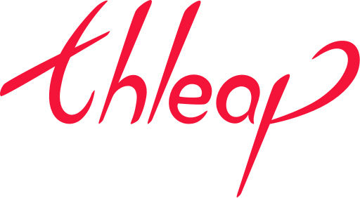
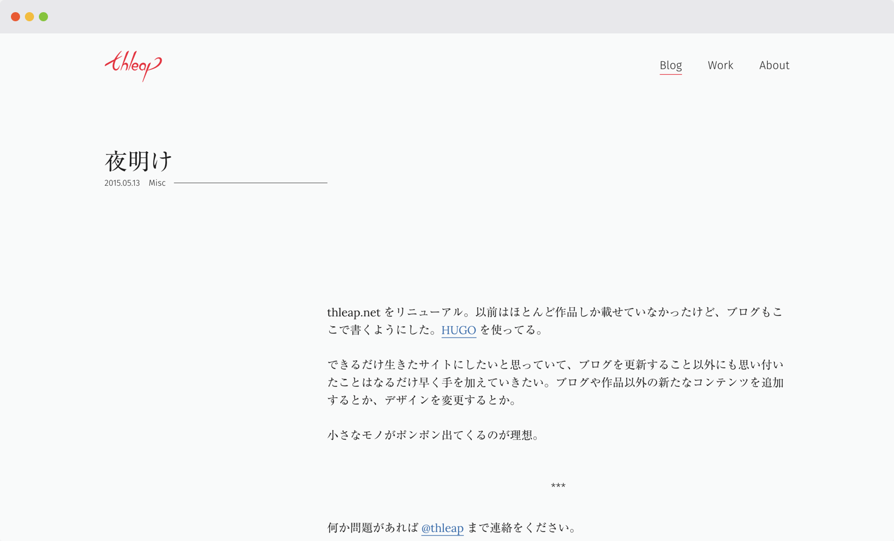

このサイトではブログの更新と作品の展示をおこないました。

<figure class="figure">
  

  <figcaption class="figure__caption">サイトのトップ</figcaption>
</figure>

thleapという名前は、サイトのキャッチコピーにもしている「think deeply &amp; leap lightly!（深く考えて軽やかに跳ぶ）」を短縮した造語です。

"深く考える" というのはブログの更新を頻繁におこなうなど、自分の考えをアウトプットし続けることで体現できると思いました。ですので、ロゴのデザインを考えるにあたっては、もうひとつのイメージである "軽やかに跳ぶ" という印象が感じられるようなデザインにしました。

<figure class="figure">
  

  <figcaption class="figure__caption">ロゴ</figcaption>
</figure>

サイトに関してはデザイナーのポートフォリオということで、見た人が「オッ！」と思えるようなデザインを心がけました。とくにこだわったのはレイアウトで、訪問者がページの概要を把握してから詳細に向けて読み進めるように、タイトルまわりと本文が大きく離れたレイアウトを採用しました。

<figure class="figure">
  

  <figcaption class="figure__caption">ブログ記事ページ</figcaption>
</figure>

展示していた作品は今と変わらず、Webサイトの制作とイラストレーションが中心でした。

<figure class="figure">
  

  <figcaption class="figure__caption">作品一覧ページ</figcaption>
</figure>
<figure class="figure">
  

  <figcaption class="figure__caption">作品紹介ページ</figcaption>
</figure>

サイトの開発面を見ると、記事作成コストを下げるために静的サイトジェネレーターの<a href="https://gohugo.io">HUGO</a>を使ったり、デプロイシステム（開発環境から本番環境にコードをアップするシステム）に<a href="http://www.wercker.com">Wercker</a>を使ったり、シンプルなビルドフローを目指してMakeを使ったり、個人的には技術的なチャレンジも多いプロジェクトでした。

