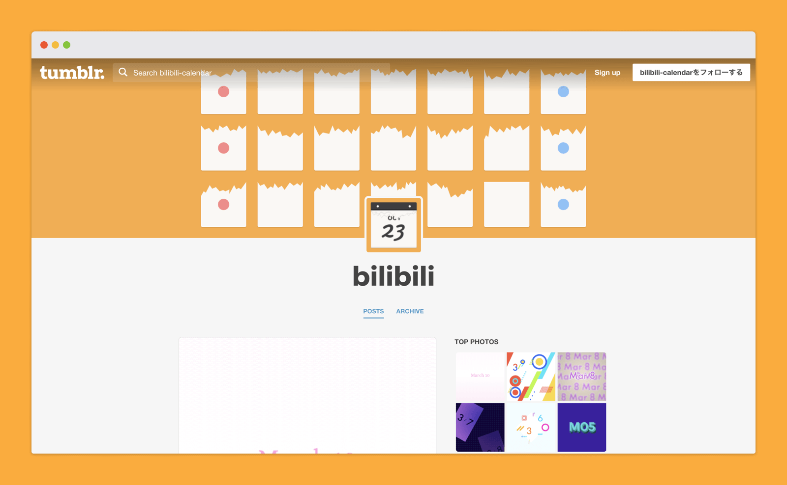

bilibili calendarは日付入り画像のデザインアイデア集です。10月23日〜3月10日まで、全部で140のアイデアを考えました。

デザインの幅を広げることを目的にしたこのプロジェクトでは、日付入り画像のデザインにできるだけバリエーションを持たせています。また、継続してつくり続けるために1つのアイデアは必ず30分以内で完成させました。

<figure class="figure">
  

  <figcaption class="figure__caption">サイトのトップ</figcaption>
</figure>

たとえば10月25日の画像を見てみましょう。

丸みのあるフォント、ドットのパターン、淡い色合いがかわいらしさを演出していますが、補色関係にあたる前面の赤と背面の青が全体を引き締めることで、かわいいだけじゃない、バランスのとれたデザインになっています。

<figure class="figure">
  

  <figcaption class="figure__caption">10月25日の画像</figcaption>
</figure>

日付入り画像の一覧はサイトの<a href="https://bilibili-calendar.tumblr.com/archive">アーカイブページ</a>から確認できます。たくさん用意したので、1つくらいは「なかなかいいんじゃないの」と言ってもらえるものがある... はず！

<figure class="figure">
  

  <figcaption class="figure__caption">アーカイブページ</figcaption>
</figure>

さて、あとはこぼれ話です。実はこのプロジェクト、1年間続ける予定ではじめました。しかし発想力が足りず、これ以上続けても新しいデザインがつくれないと思ったので、プロジェクトを途中で打ち切ることに。

デザインの幅を広げるには良い練習だったので、またいつか再スタートさせたいと思っています。

